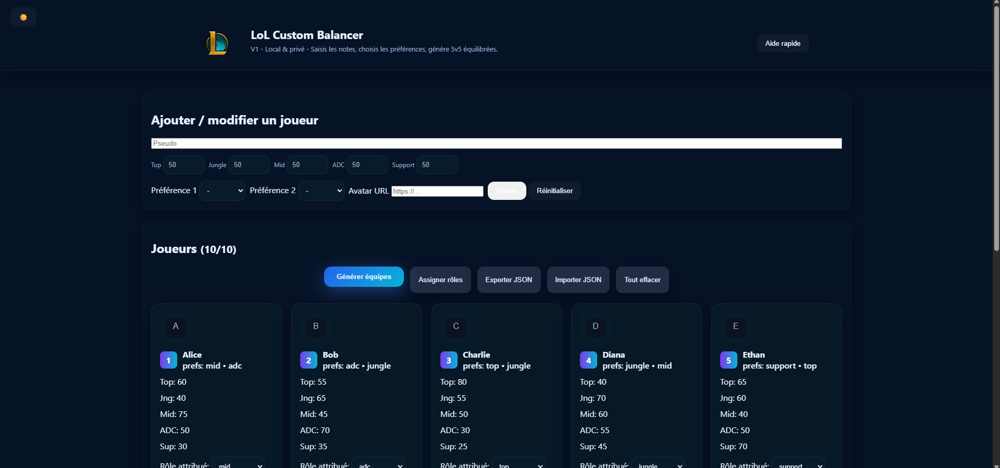
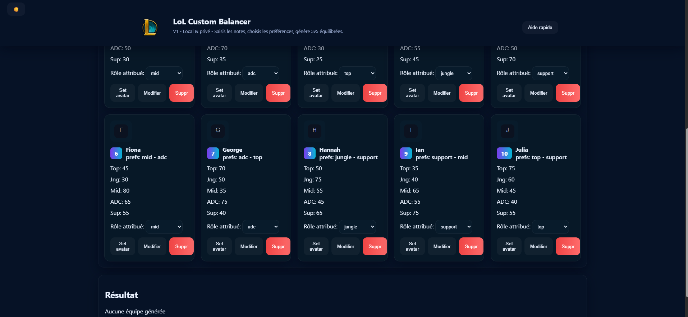
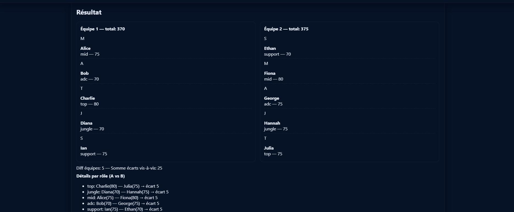

# LoL Balancer

**LoL Balancer** est une application web simple et rapide conçue pour générer des équipes équilibrées pour vos parties personnalisées (Custom Games) sur League of Legends. 

## Objectif du Projet

Fini les débats interminables pour savoir qui va dans quelle équipe ! Ce projet permet de répartir automatiquement les joueurs en deux équipes (Équipe Bleue et Équipe Rouge) de manière équitable, en se basant sur leur niveau ou leur rang. 

## Aperçu de l'application

### Affichage des points attribués



### Affichage des résultats


## Fonctionnalités Principales

* **Ajout de joueurs** : Saisie des pseudos et des niveaux/rangs des participants.
* **Équilibrage automatique** : Algorithme répartissant les joueurs pour obtenir deux équipes au niveau global le plus proche possible.
* **Sauvegarde et Exportation** : Possibilité d'exporter la liste des joueurs et les configurations via des fichiers JSON (`lol_balancer_export.json`).
* **Interface intuitive** : Application "Single Page" (SPA) fluide et réactive.

## Stack Technique

Ce projet est construit avec des technologies web standards (Vanilla), sans framework lourd, garantissant une exécution ultra-rapide directement dans le navigateur :

* **Frontend** : HTML5, CSS3
* **Logique** : JavaScript (Vanilla JS)
* **Stockage/Data** : Fichiers JSON pour l'import/export

## Architecture du Projet

Le projet est structuré de la manière suivante :

```text
/lol-balancerv1
 ├── index.html                  # Point d'entrée de l'application
 ├── styles.css                  # Feuilles de style pour le design
 ├── main.js                     # Logique de l'application et algorithme d'équilibrage
 ├── lol_balancer_export.json    # Exemple de fichier d'export de données
 └── test.json                   # Fichier de données de test
